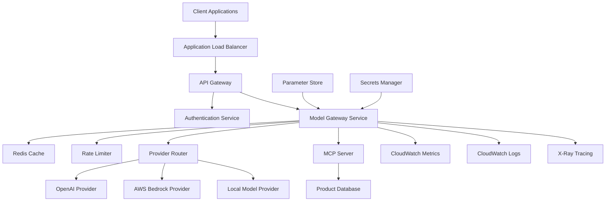
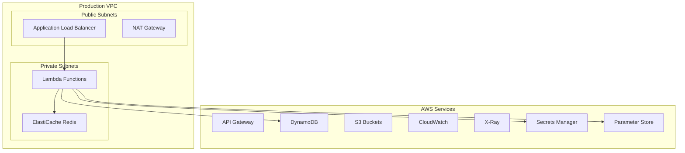

# Design Document

## Overview

The AI Model Gateway with MCP Integration is a cloud-native platform built on AWS that provides secure, scalable, and cost-efficient access to multiple LLM providers. The system implements the Model Context Protocol (MCP) to bridge e-commerce product data with LLM applications, demonstrating production-ready AI infrastructure patterns.

The architecture follows microservices principles with event-driven communication, comprehensive observability, and Infrastructure as Code deployment using AWS CDK.

## Architecture

### High-Level Architecture



### Service Architecture

The system is composed of the following core services:

1. **API Gateway Layer**: Entry point with authentication, rate limiting, and request routing
2. **Model Gateway Service**: Core orchestration service handling LLM provider routing
3. **MCP Server**: Implements Model Context Protocol for product data integration
4. **Provider Adapters**: Standardized interfaces for different LLM providers
5. **Observability Stack**: Comprehensive monitoring, logging, and tracing

## Components and Interfaces

### 1. API Gateway Service

**Purpose**: Handles incoming requests, authentication, and initial request validation.

**Key Components**:
- AWS API Gateway with Lambda authorizer
- Rate limiting using API Gateway throttling
- Request/response transformation
- CORS handling for web clients

**Interfaces**:
```typescript
interface GatewayRequest {
  method: string;
  path: string;
  headers: Record<string, string>;
  body: string;
  queryParameters: Record<string, string>;
}

interface GatewayResponse {
  statusCode: number;
  headers: Record<string, string>;
  body: string;
}
```

### 2. Model Gateway Service

**Purpose**: Core service that orchestrates LLM requests across multiple providers.

**Key Components**:
- Provider routing logic with failover
- Request/response caching using Redis
- Cost tracking and optimization
- Batch processing for efficiency

**Interfaces**:
```typescript
interface LLMRequest {
  model: string;
  messages: ChatMessage[];
  temperature?: number;
  maxTokens?: number;
  stream?: boolean;
  mcpContext?: MCPContext;
}

interface LLMResponse {
  id: string;
  model: string;
  choices: ChatChoice[];
  usage: TokenUsage;
  cost: number;
  latency: number;
  provider: string;
}

interface ProviderAdapter {
  name: string;
  isAvailable(): Promise<boolean>;
  generateCompletion(request: LLMRequest): Promise<LLMResponse>;
  estimateCost(request: LLMRequest): number;
}
```

### 3. MCP Server Implementation

**Purpose**: Provides structured access to e-commerce product data through MCP protocol.

**Key Components**:
- MCP protocol implementation
- Product data indexing and search
- Real-time inventory integration
- Structured data formatting for LLMs

**Interfaces**:
```typescript
interface MCPServer {
  initialize(): Promise<void>;
  handleRequest(request: MCPRequest): Promise<MCPResponse>;
  getTools(): MCPTool[];
  getResources(): MCPResource[];
}

interface ProductSearchTool {
  name: "product_search";
  description: string;
  inputSchema: JSONSchema;
  execute(params: ProductSearchParams): Promise<ProductResult[]>;
}

interface ProductData {
  id: string;
  name: string;
  description: string;
  price: number;
  currency: string;
  availability: boolean;
  category: string;
  specifications: Record<string, any>;
  images: string[];
}
```

### 4. Provider Adapters

**Purpose**: Standardized interfaces for different LLM providers with consistent error handling.

**OpenAI Adapter**:
```typescript
class OpenAIAdapter implements ProviderAdapter {
  name = "openai";
  
  async generateCompletion(request: LLMRequest): Promise<LLMResponse> {
    // OpenAI API integration with retry logic
  }
  
  estimateCost(request: LLMRequest): number {
    // Token-based cost calculation
  }
}
```

**AWS Bedrock Adapter**:
```typescript
class BedrockAdapter implements ProviderAdapter {
  name = "bedrock";
  
  async generateCompletion(request: LLMRequest): Promise<LLMResponse> {
    // Bedrock API integration with IAM authentication
  }
  
  estimateCost(request: LLMRequest): number {
    // Bedrock pricing model calculation
  }
}
```

## Data Models

### Request/Response Models

```typescript
interface ChatMessage {
  role: "system" | "user" | "assistant";
  content: string;
  name?: string;
}

interface ChatChoice {
  index: number;
  message: ChatMessage;
  finishReason: string;
}

interface TokenUsage {
  promptTokens: number;
  completionTokens: number;
  totalTokens: number;
}
```

### Configuration Models

```typescript
interface ProviderConfig {
  name: string;
  enabled: boolean;
  priority: number;
  maxConcurrency: number;
  timeout: number;
  retryAttempts: number;
  costPerToken: number;
}

interface RateLimitConfig {
  requestsPerMinute: number;
  requestsPerHour: number;
  requestsPerDay: number;
  burstLimit: number;
}
```

### Database Schema

**Product Table (DynamoDB)**:
```typescript
interface ProductRecord {
  PK: string; // "PRODUCT#${productId}"
  SK: string; // "METADATA"
  productId: string;
  name: string;
  description: string;
  price: number;
  currency: string;
  category: string;
  availability: boolean;
  specifications: Record<string, any>;
  createdAt: string;
  updatedAt: string;
  GSI1PK: string; // "CATEGORY#${category}"
  GSI1SK: string; // "PRICE#${price}"
}
```

**Request Logs Table (DynamoDB)**:
```typescript
interface RequestLog {
  PK: string; // "REQUEST#${requestId}"
  SK: string; // "LOG"
  requestId: string;
  userId: string;
  provider: string;
  model: string;
  tokens: number;
  cost: number;
  latency: number;
  timestamp: string;
  success: boolean;
  errorMessage?: string;
}
```

## Error Handling

### Error Types and Responses

```typescript
enum ErrorType {
  AUTHENTICATION_ERROR = "AUTHENTICATION_ERROR",
  RATE_LIMIT_EXCEEDED = "RATE_LIMIT_EXCEEDED",
  PROVIDER_UNAVAILABLE = "PROVIDER_UNAVAILABLE",
  INVALID_REQUEST = "INVALID_REQUEST",
  INTERNAL_ERROR = "INTERNAL_ERROR"
}

interface ErrorResponse {
  error: {
    type: ErrorType;
    message: string;
    code: string;
    details?: Record<string, any>;
    retryAfter?: number;
  };
  requestId: string;
  timestamp: string;
}
```

### Retry Strategy

- **Exponential Backoff**: Start with 1s, double each retry, max 30s
- **Circuit Breaker**: Open circuit after 5 consecutive failures
- **Provider Failover**: Automatic failover to secondary providers
- **Graceful Degradation**: Return cached responses when possible

## Testing Strategy

### Unit Testing
- **Provider Adapters**: Mock external API calls, test error handling
- **MCP Server**: Test protocol compliance and data formatting
- **Rate Limiter**: Test various rate limiting scenarios
- **Authentication**: Test token validation and authorization

### Integration Testing
- **End-to-End Flows**: Test complete request lifecycle
- **Provider Integration**: Test actual API calls with test accounts
- **Database Operations**: Test DynamoDB operations with local instance
- **Cache Behavior**: Test Redis caching scenarios

### Load Testing
- **Performance Benchmarks**: Test system under various load patterns
- **Scalability Testing**: Verify auto-scaling behavior
- **Cost Analysis**: Monitor costs under different usage patterns
- **Failover Testing**: Test provider failover scenarios

### Security Testing
- **Authentication Testing**: Test various auth scenarios and edge cases
- **Input Validation**: Test malicious input handling
- **Rate Limiting**: Test rate limit bypass attempts
- **Data Encryption**: Verify encryption in transit and at rest

## Deployment Architecture

### AWS Infrastructure



### CDK Stack Structure

```typescript
// Main application stack
export class AIModelGatewayStack extends Stack {
  constructor(scope: Construct, id: string, props: StackProps) {
    // API Gateway and Lambda functions
    // DynamoDB tables
    // ElastiCache Redis cluster
    // IAM roles and policies
    // CloudWatch dashboards and alarms
  }
}

// Monitoring and observability stack
export class ObservabilityStack extends Stack {
  // CloudWatch dashboards
  // Custom metrics and alarms
  // X-Ray tracing configuration
  // Log groups and retention policies
}

// Security and compliance stack
export class SecurityStack extends Stack {
  // WAF rules
  // Secrets Manager secrets
  // IAM roles and policies
  // VPC and security groups
}
```

## Performance and Scalability

### Scaling Strategy
- **Lambda Concurrency**: Reserved concurrency for critical functions
- **DynamoDB**: On-demand billing with auto-scaling
- **Redis**: Cluster mode for high availability
- **API Gateway**: Built-in scaling and throttling

### Performance Targets
- **Latency**: P95 < 2s for LLM requests
- **Throughput**: 1000 requests/second sustained
- **Availability**: 99.9% uptime SLA
- **Cost**: < $0.01 per request including LLM costs

### Caching Strategy
- **Response Caching**: Cache identical requests for 5 minutes
- **Provider Routing**: Cache provider health status
- **Configuration**: Cache feature flags and settings
- **Product Data**: Cache frequently accessed product information