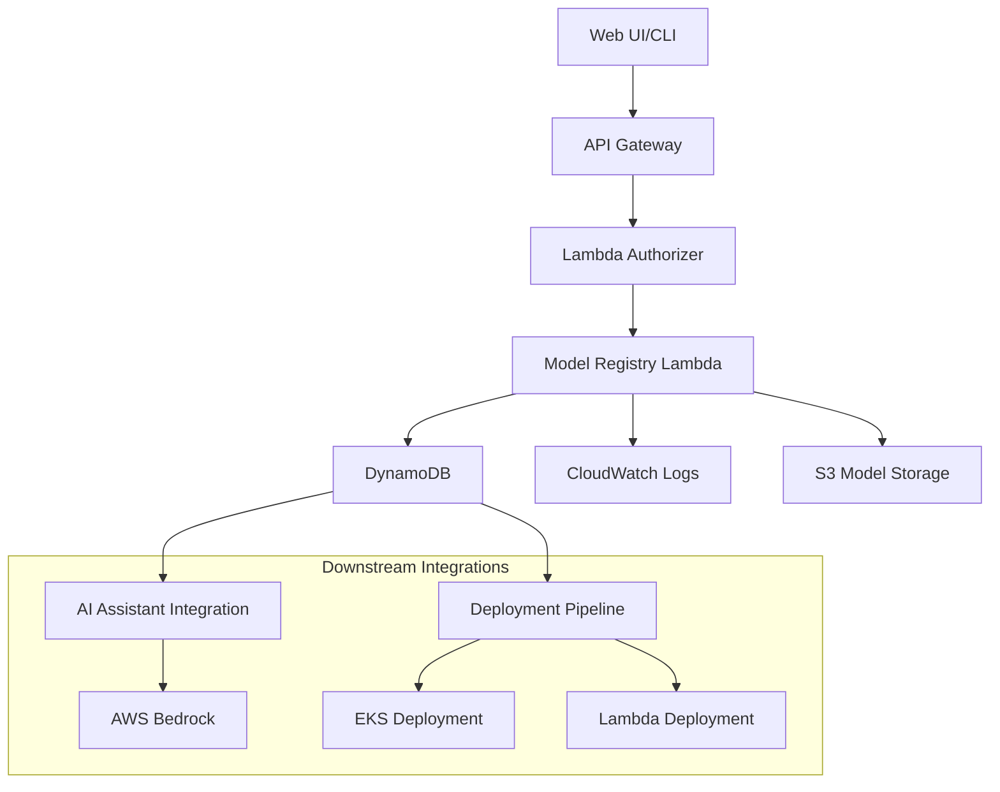

# Model Registry Design Document

## Overview

The Model Registry is a serverless microservice that provides centralized metadata management for ML models in a self-service platform. It serves as the foundation for model deployment pipelines and AI-powered operations, built using AWS serverless technologies with Infrastructure as Code principles.

## Architecture

### High-Level Architecture



### Architectural Decisions & Learning Points

#### Why DynamoDB Over Other Databases?

**Decision: DynamoDB for metadata storage**

**Rationale:**
1. **Serverless-First**: No server management, automatic scaling, pay-per-use pricing model
2. **Performance**: Single-digit millisecond latency for model lookups during deployment
3. **Scalability**: Handles unpredictable traffic patterns as teams scale model registrations
4. **Integration**: Native integration with Lambda, CloudWatch, and other AWS services
5. **Durability**: 99.999999999% (11 9's) durability with multi-AZ replication

**vs. RDS**: Would require connection pooling, VPC configuration, and scaling management
**vs. Aurora Serverless**: Higher cold start latency, more complex for simple key-value operations
**vs. DocumentDB**: Overkill for structured metadata, higher operational overhead

#### DynamoDB Schema Design for Versioning

**Primary Design Pattern: Composite Primary Key**

```
Partition Key (PK): MODEL#{modelId}
Sort Key (SK): VERSION#{version}
```

**Schema Structure:**
```json
{
  "PK": "MODEL#ml-fraud-detector",
  "SK": "VERSION#1.2.0",
  "modelName": "fraud-detector",
  "version": "1.2.0",
  "framework": "scikit-learn",
  "s3Uri": "s3://ml-models/fraud-detector/v1.2.0/model.pkl",
  "deploymentTarget": "EKS",
  "status": "REGISTERED",
  "teamId": "data-science-team",
  "createdAt": "2024-01-15T10:30:00Z",
  "metadata": {
    "accuracy": 0.95,
    "features": ["transaction_amount", "user_age"],
    "description": "Fraud detection model using ensemble methods"
  },
  "GSI1PK": "TEAM#data-science-team",
  "GSI1SK": "MODEL#ml-fraud-detector#VERSION#1.2.0"
}
```

**Access Patterns Supported:**
1. **Get specific model version**: Query by PK + SK
2. **List all versions of a model**: Query by PK only
3. **List models by team**: Query GSI1 by team
4. **List all models**: Scan (with pagination)

**Why This Schema Works:**
- **Version Management**: Sort key enables chronological ordering and range queries
- **Hot Partitions**: Model ID distribution prevents hot partition issues
- **Query Efficiency**: Single-item reads for deployment lookups
- **Extensibility**: JSON metadata field allows flexible model attributes

## Components and Interfaces

### API Gateway Configuration

**REST API Design:**
```
POST   /api/v1/models                    # Register new model
GET    /api/v1/models                    # List all models (paginated)
GET    /api/v1/models/{modelId}          # Get all versions of a model
GET    /api/v1/models/{modelId}/{version} # Get specific model version
PUT    /api/v1/models/{modelId}/{version} # Update model metadata
DELETE /api/v1/models/{modelId}/{version} # Deregister model version
POST   /api/v1/models/{modelId}/{version}/deploy # Trigger deployment pipeline
```

**API Gateway Integration Patterns:**
- **Lambda Proxy Integration**: Simplifies request/response handling
- **Request Validation**: Schema validation at API Gateway level
- **CORS Configuration**: Enables web UI integration
- **Throttling**: Rate limiting per API key/team
- **Caching**: Response caching for frequently accessed models

### Lambda Function Architecture

**Single Lambda vs. Multiple Functions Decision:**

**Chosen: Single Lambda with Handler Routing**

**Rationale:**
- **Cold Start Optimization**: Shared initialization code and connections
- **Code Reuse**: Common validation, error handling, and DynamoDB operations
- **Simplified Deployment**: Single CDK construct, easier CI/CD
- **Cost Efficiency**: Reduced Lambda invocation overhead

**Function Structure:**
```typescript
// Handler routing pattern
export const handler = async (event: APIGatewayProxyEvent): Promise<APIGatewayProxyResult> => {
  const { httpMethod, resource, pathParameters } = event;
  
  try {
    switch (`${httpMethod} ${resource}`) {
      case 'POST /api/v1/models':
        return await registerModel(event);
      case 'GET /api/v1/models':
        return await listModels(event);
      case 'GET /api/v1/models/{modelId}':
        return await getModelVersions(event);
      case 'POST /api/v1/models/{modelId}/{version}/deploy':
        return await triggerDeployment(event);
      // ... other routes
    }
  } catch (error) {
    return handleError(error);
  }
};
```

### Deployment Pipeline Integration

**EventBridge Integration for Deployment Triggering:**

```typescript
// Deployment trigger handler
const triggerDeployment = async (event: APIGatewayProxyEvent) => {
  const { modelId, version } = event.pathParameters!;
  
  // Get model metadata
  const model = await getModelVersion(modelId, version);
  
  // Update status to DEPLOYING
  await updateModelStatus(modelId, version, 'DEPLOYING');
  
  // Publish deployment event to EventBridge
  await eventBridge.putEvents({
    Entries: [{
      Source: 'model-registry',
      DetailType: 'Model Deployment Requested',
      Detail: JSON.stringify({
        modelId,
        version,
        deploymentTarget: model.deploymentTarget,
        s3Uri: model.s3Uri,
        framework: model.framework,
        teamId: model.teamId
      })
    }]
  }).promise();
  
  return {
    statusCode: 202,
    body: JSON.stringify({
      message: 'Deployment initiated',
      deploymentId: generateDeploymentId(),
      status: 'DEPLOYING'
    })
  };
};
```

**Integration with Downstream Services:**
- **EKS Deployment Service**: Listens for deployment events, creates Kubernetes deployments
- **Lambda Deployment Service**: Handles serverless model deployments
- **Status Updates**: Deployment services update model status via callback API

### Authentication and Authorization

**Lambda Authorizer Pattern:**
```typescript
// Custom authorizer for team-based access control
export const authorizer = async (event: APIGatewayTokenAuthorizerEvent) => {
  const token = event.authorizationToken;
  const teamId = await validateTokenAndGetTeam(token);
  
  return {
    principalId: teamId,
    policyDocument: generatePolicy('Allow', event.methodArn),
    context: { teamId }
  };
};
```

## Data Models

### Core Model Interface

```typescript
interface ModelRegistration {
  modelId: string;           // Unique identifier
  modelName: string;         // Human-readable name
  version: string;           // Semantic version (1.0.0)
  framework: ModelFramework; // Enum: scikit-learn, tensorflow, pytorch, etc.
  s3Uri: string;            // S3 location of model artifacts
  deploymentTarget: DeploymentTarget; // EKS | Lambda
  status: ModelStatus;       // REGISTERED | DEPLOYING | DEPLOYED | FAILED
  teamId: string;           // Owning team identifier
  createdAt: string;        // ISO timestamp
  updatedAt: string;        // ISO timestamp
  metadata: ModelMetadata;   // Flexible metadata object
}

interface ModelMetadata {
  description?: string;
  accuracy?: number;
  features?: string[];
  modelSize?: number;       // Size in bytes
  trainingDataset?: string;
  hyperparameters?: Record<string, any>;
  tags?: string[];
}

enum ModelFramework {
  SCIKIT_LEARN = 'scikit-learn',
  TENSORFLOW = 'tensorflow',
  PYTORCH = 'pytorch',
  XGBOOST = 'xgboost',
  LIGHTGBM = 'lightgbm'
}

enum DeploymentTarget {
  EKS = 'EKS',
  LAMBDA = 'Lambda'
}

enum ModelStatus {
  REGISTERED = 'REGISTERED',
  DEPLOYING = 'DEPLOYING',
  DEPLOYED = 'DEPLOYED',
  FAILED = 'FAILED',
  DEPRECATED = 'DEPRECATED'
}
```

### Request/Response Models

```typescript
interface RegisterModelRequest {
  modelName: string;
  version: string;
  framework: ModelFramework;
  s3Uri: string;
  deploymentTarget: DeploymentTarget;
  metadata?: ModelMetadata;
}

interface RegisterModelResponse {
  modelId: string;
  message: string;
  registrationTime: string;
}

interface ListModelsResponse {
  models: ModelSummary[];
  pagination: {
    nextToken?: string;
    totalCount: number;
  };
}
```

## Error Handling

### Error Classification and Responses

```typescript
enum ErrorType {
  VALIDATION_ERROR = 'VALIDATION_ERROR',
  RESOURCE_NOT_FOUND = 'RESOURCE_NOT_FOUND',
  DUPLICATE_RESOURCE = 'DUPLICATE_RESOURCE',
  UNAUTHORIZED = 'UNAUTHORIZED',
  INTERNAL_ERROR = 'INTERNAL_ERROR',
  EXTERNAL_SERVICE_ERROR = 'EXTERNAL_SERVICE_ERROR'
}

interface ErrorResponse {
  error: {
    type: ErrorType;
    message: string;
    details?: Record<string, string>;
    correlationId: string;
    timestamp: string;
  };
}
```

### Error Handling Strategy

1. **Input Validation**: Joi schema validation with detailed field errors
2. **Business Logic Errors**: Custom error classes with specific HTTP status codes
3. **Infrastructure Errors**: Generic error responses with detailed CloudWatch logging
4. **Correlation IDs**: UUID tracking across all logs and responses
5. **Circuit Breaker**: Graceful degradation for S3 validation calls

## Testing Strategy

### Unit Testing Approach

```typescript
// Example test structure
describe('ModelRegistryService', () => {
  describe('registerModel', () => {
    it('should register a new model successfully', async () => {
      // Arrange
      const mockDynamoDB = createMockDynamoDB();
      const service = new ModelRegistryService(mockDynamoDB);
      
      // Act
      const result = await service.registerModel(validModelRequest);
      
      // Assert
      expect(result.modelId).toBeDefined();
      expect(mockDynamoDB.put).toHaveBeenCalledWith(expectedDynamoItem);
    });
    
    it('should reject duplicate model versions', async () => {
      // Test duplicate handling
    });
  });
});
```

### Integration Testing

1. **API Gateway Integration**: Test complete request/response flow
2. **DynamoDB Integration**: Test actual database operations with LocalStack
3. **S3 Validation**: Test S3 URI validation and access
4. **Error Scenarios**: Test timeout, throttling, and failure conditions

### Load Testing Considerations

- **DynamoDB Capacity**: Test auto-scaling behavior under load
- **Lambda Concurrency**: Validate concurrent execution limits
- **API Gateway Throttling**: Test rate limiting effectiveness

## Infrastructure as Code (CDK)

### CDK Stack Structure

```typescript
export class ModelRegistryStack extends Stack {
  constructor(scope: Construct, id: string, props?: StackProps) {
    super(scope, id, props);

    // DynamoDB Table
    const modelsTable = new Table(this, 'ModelsTable', {
      partitionKey: { name: 'PK', type: AttributeType.STRING },
      sortKey: { name: 'SK', type: AttributeType.STRING },
      billingMode: BillingMode.PAY_PER_REQUEST,
      pointInTimeRecovery: true,
      encryption: TableEncryption.AWS_MANAGED
    });

    // Global Secondary Index for team queries
    modelsTable.addGlobalSecondaryIndex({
      indexName: 'GSI1',
      partitionKey: { name: 'GSI1PK', type: AttributeType.STRING },
      sortKey: { name: 'GSI1SK', type: AttributeType.STRING }
    });

    // Lambda Function
    const modelRegistryFunction = new Function(this, 'ModelRegistryFunction', {
      runtime: Runtime.NODEJS_18_X,
      handler: 'index.handler',
      code: Code.fromAsset('lambda'),
      environment: {
        MODELS_TABLE_NAME: modelsTable.tableName,
        LOG_LEVEL: 'INFO'
      },
      timeout: Duration.seconds(30),
      memorySize: 512
    });

    // API Gateway
    const api = new RestApi(this, 'ModelRegistryApi', {
      restApiName: 'Model Registry API',
      description: 'API for ML model registration and discovery',
      defaultCorsPreflightOptions: {
        allowOrigins: Cors.ALL_ORIGINS,
        allowMethods: Cors.ALL_METHODS
      }
    });

    // Grant permissions
    modelsTable.grantReadWriteData(modelRegistryFunction);
  }
}
```

### CDK Best Practices Demonstrated

1. **Resource Naming**: Consistent naming conventions with construct IDs
2. **Environment Variables**: Configuration through environment variables
3. **IAM Permissions**: Principle of least privilege with specific grants
4. **Encryption**: AWS-managed encryption for data at rest
5. **Monitoring**: Built-in CloudWatch integration
6. **Tagging**: Resource tagging for cost allocation and governance

## CloudWatch Integration

### Logging Strategy

```typescript
// Structured logging with correlation IDs
const logger = {
  info: (message: string, meta: Record<string, any> = {}) => {
    console.log(JSON.stringify({
      level: 'INFO',
      message,
      correlationId: meta.correlationId,
      timestamp: new Date().toISOString(),
      ...meta
    }));
  }
};
```

### Metrics and Alarms

1. **Custom Metrics**: Model registration counts, error rates
2. **Lambda Metrics**: Duration, error rate, throttles
3. **DynamoDB Metrics**: Read/write capacity, throttling
4. **API Gateway Metrics**: Request count, latency, 4xx/5xx errors

### Dashboards

- **Operational Dashboard**: Real-time metrics and health status
- **Business Dashboard**: Model registration trends and team usage
- **Error Dashboard**: Error rates and failure analysis