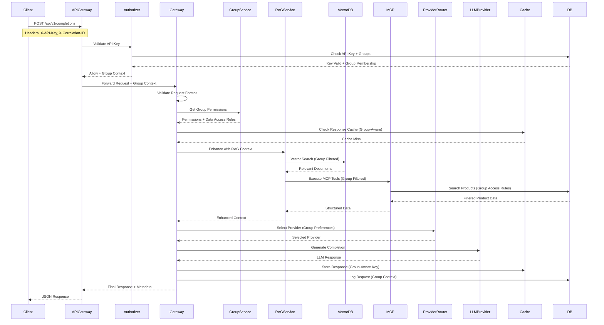
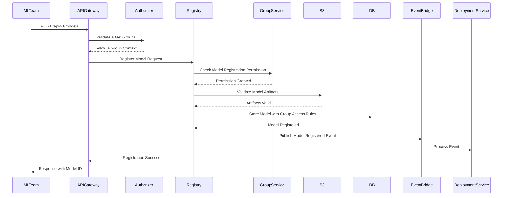

# 🔄 04. API DESIGN & DATA FLOWS
## Complete Request/Response Patterns and System Workflows

> **READ AFTER**: 03_RAG_VECTOR_KNOWLEDGE.md
> **PURPOSE**: Master API design patterns and data flow workflows

---

## 🎯 **API DESIGN PRINCIPLES FOR ENTERPRISE AI PLATFORM**

### **RESTful API Design with Group-Aware Routing**
```typescript
// API Endpoint Structure
const apiEndpoints = {
  // Core LLM endpoints
  'POST /api/v1/completions': 'Generate LLM completions with group context',
  'POST /api/v1/completions/stream': 'Streaming LLM responses',
  'POST /api/v1/completions/batch': 'Batch processing for multiple requests',
  
  // Model registry endpoints
  'GET /api/v1/models': 'List models accessible to user group',
  'POST /api/v1/models': 'Register new model (admin groups only)',
  'GET /api/v1/models/{id}': 'Get model details with group filtering',
  'POST /api/v1/models/{id}/deploy': 'Deploy model (deploy permission required)',
  
  // Group management endpoints
  'GET /api/v1/groups': 'List user groups and permissions',
  'GET /api/v1/groups/{id}/permissions': 'Get group permissions',
  'POST /api/v1/groups/{id}/members': 'Add user to group (admin only)',
  
  // Analytics and monitoring
  'GET /api/v1/analytics/usage': 'Usage analytics for user group',
  'GET /api/v1/analytics/costs': 'Cost breakdown by group',
  'GET /api/v1/health': 'System health check',
  'GET /api/v1/health/detailed': 'Detailed health with group-specific status'
};
```

### **Standardized Request/Response Format**
```typescript
// Enhanced Request Format with Group Context
interface EnhancedAPIRequest<T> {
  // Standard headers
  headers: {
    'Content-Type': 'application/json';
    'X-API-Key': string;
    'X-Correlation-ID': string;
    'X-Request-ID': string;
    'X-User-Agent': string;
    'X-Group-Context'?: string; // Optional group override
  };
  
  // Request body with metadata
  body: {
    data: T;
    metadata?: {
      userId?: string;
      sessionId?: string;
      clientVersion?: string;
      priority?: 'low' | 'normal' | 'high';
      groupOverride?: string; // For admin users
    };
  };
}

// Enhanced Response Format with Group Information
interface EnhancedAPIResponse<T> {
  success: boolean;
  data?: T;
  
  error?: {
    code: string;
    message: string;
    details?: Record<string, any>;
    retryable?: boolean;
  };
  
  metadata: {
    requestId: string;
    correlationId: string;
    timestamp: string;
    latency: number;
    
    // Group context information
    userGroups: string[];
    effectivePermissions: string[];
    dataAccessLevel: 'public' | 'internal' | 'confidential';
    
    // Caching information
    cached?: boolean;
    cacheAge?: number;
    
    // Provider information (for LLM requests)
    provider?: string;
    model?: string;
    tokensUsed?: number;
    cost?: number;
  };
  
  pagination?: {
    page: number;
    limit: number;
    total: number;
    hasNext: boolean;
    nextToken?: string;
  };
}
```

---

## 🔄 **COMPLETE DATA FLOW DIAGRAMS**

### **1. Group-Aware LLM Request Flow**



### **2. Model Registry with Group Access Control**



---

## 📊 **DETAILED READ/WRITE WORKFLOWS**

### **Write Operations: Group-Aware Model Registration**

```typescript
async function registerModelWithGroupAccess(
  request: RegisterModelRequest,
  userContext: UserContext,
  correlationId: string
): Promise<ModelRegistrationResponse> {
  
  const startTime = Date.now();
  
  try {
    // 1. Validate Group Permissions
    const hasPermission = await groupService.hasPermission(
      userContext.groups,
      'models',
      'create'
    );
    
    if (!hasPermission) {
      throw new ForbiddenError('Insufficient permissions to register models');
    }
    
    // 2. Input Validation with Group Context
    const validatedRequest = await validateModelRequest(request, userContext);
    
    // 3. Determine Model Access Rules Based on User Group
    const accessRules = await determineModelAccessRules(
      validatedRequest,
      userContext.groups
    );
    
    // 4. Business Logic Validation
    await validateS3Artifacts(validatedRequest.s3Uri, userContext);
    await checkDuplicateVersion(
      validatedRequest.modelName, 
      validatedRequest.version,
      userContext.groups // Check within group scope
    );
    
    // 5. Generate Model Record with Group Information
    const modelId = generateModelId(validatedRequest.modelName);
    const timestamp = new Date().toISOString();
    
    const modelRecord: EnhancedModelRegistration = {
      // Standard fields
      PK: `MODEL#${modelId}`,
      SK: `VERSION#${validatedRequest.version}`,
      modelId,
      modelName: validatedRequest.modelName,
      version: validatedRequest.version,
      framework: validatedRequest.framework,
      s3Uri: validatedRequest.s3Uri,
      deploymentTarget: validatedRequest.deploymentTarget,
      status: ModelStatus.REGISTERED,
      createdAt: timestamp,
      updatedAt: timestamp,
      metadata: validatedRequest.metadata || {},
      
      // Group-specific fields
      ownerGroups: userContext.groups,
      accessLevel: accessRules.accessLevel,
      allowedGroups: accessRules.allowedGroups,
      restrictedGroups: accessRules.restrictedGroups,
      createdBy: userContext.userId,
      
      // GSI keys for group-based queries
      GSI1PK: `TEAM#${userContext.groups[0]}`, // Primary group
      GSI1SK: `MODEL#${modelId}#VERSION#${validatedRequest.version}`,
      GSI2PK: `ACCESS#${accessRules.accessLevel}`,
      GSI2SK: `FRAMEWORK#${validatedRequest.framework}#MODEL#${modelId}`,
      GSI3PK: `DEPLOYMENT#${validatedRequest.deploymentTarget}`,
      GSI3SK: `GROUP#${userContext.groups[0]}#MODEL#${modelId}`,
    };
    
    // 6. Atomic Write with Conditional Check
    await dynamoClient.send(new PutCommand({
      TableName: MODELS_TABLE_NAME,
      Item: modelRecord,
      ConditionExpression: 'attribute_not_exists(PK) AND attribute_not_exists(SK)',
    }));
    
    // 7. Emit Events and Metrics
    await Promise.all([
      // Emit registration event
      eventBridge.putEvents([{
        Source: 'model-registry',
        DetailType: 'Model Registered',
        Detail: JSON.stringify({
          modelId,
          version: validatedRequest.version,
          ownerGroups: userContext.groups,
          accessLevel: accessRules.accessLevel,
          correlationId
        })
      }]),
      
      // Record metrics by group
      metricsService.recordModelRegistration(
        userContext.groups[0],
        validatedRequest.framework,
        validatedRequest.deploymentTarget,
        correlationId
      ),
      
      // Update group usage statistics
      groupService.updateUsageStats(
        userContext.groups,
        'model_registration',
        1
      )
    ]);
    
    // 8. Return Success Response
    return {
      modelId,
      message: 'Model registered successfully',
      registrationTime: timestamp,
      accessLevel: accessRules.accessLevel,
      allowedGroups: accessRules.allowedGroups,
      metadata: {
        correlationId,
        latency: Date.now() - startTime,
        userGroups: userContext.groups,
        effectivePermissions: await groupService.getEffectivePermissions(userContext.groups)
      }
    };
    
  } catch (error) {
    // Enhanced error handling with group context
    await logError(correlationId, userContext, error, {
      operation: 'model_registration',
      modelName: request.modelName,
      version: request.version
    });
    
    throw error;
  }
}

// Helper function to determine access rules
async function determineModelAccessRules(
  request: RegisterModelRequest,
  userGroups: string[]
): Promise<AccessRules> {
  
  // Get group access policies
  const groupPolicies = await Promise.all(
    userGroups.map(groupId => groupService.getGroupPolicy(groupId))
  );
  
  // Determine access level based on group hierarchy
  const maxAccessLevel = getMaxAccessLevel(groupPolicies);
  
  // Determine allowed groups based on model sensitivity
  let allowedGroups = userGroups;
  
  if (request.metadata?.sensitive === true) {
    // Sensitive models only accessible to admin groups
    allowedGroups = userGroups.filter(group => 
      groupPolicies.find(policy => 
        policy.groupId === group && policy.adminLevel >= 2
      )
    );
  }
  
  return {
    accessLevel: maxAccessLevel,
    allowedGroups,
    restrictedGroups: [],
    inheritFromOwner: true
  };
}
```

### **Read Operations: Group-Filtered Model Discovery**

```typescript
async function listModelsWithGroupFiltering(
  request: ListModelsRequest,
  userContext: UserContext,
  correlationId: string
): Promise<ListModelsResponse> {
  
  const startTime = Date.now();
  
  try {
    // 1. Validate Request Parameters
    const validatedRequest = validateListRequest(request);
    const limit = Math.min(validatedRequest.limit || 50, 100);
    
    // 2. Determine User's Data Access Level
    const userAccessLevel = await groupService.getUserAccessLevel(userContext.groups);
    const allowedAccessLevels = getAllowedAccessLevels(userAccessLevel);
    
    // 3. Build Query Strategy Based on Request and Permissions
    let queryCommand: QueryCommand | ScanCommand;
    let filterExpressions: string[] = [];
    let expressionAttributeValues: Record<string, any> = {};
    let expressionAttributeNames: Record<string, string> = {};
    
    // Base filter for access control
    filterExpressions.push('(contains(allowedGroups, :userGroup) OR accessLevel = :publicAccess)');
    expressionAttributeValues[':userGroup'] = userContext.groups[0]; // Primary group
    expressionAttributeValues[':publicAccess'] = 'public';
    
    // Add access level filter
    if (allowedAccessLevels.length > 0) {
      filterExpressions.push('accessLevel IN (:accessLevels)');
      expressionAttributeValues[':accessLevels'] = allowedAccessLevels;
    }
    
    // Add request-specific filters
    if (validatedRequest.framework) {
      filterExpressions.push('framework = :framework');
      expressionAttributeValues[':framework'] = validatedRequest.framework;
    }
    
    if (validatedRequest.deploymentTarget) {
      filterExpressions.push('deploymentTarget = :deploymentTarget');
      expressionAttributeValues[':deploymentTarget'] = validatedRequest.deploymentTarget;
    }
    
    if (validatedRequest.status) {
      filterExpressions.push('#status = :status');
      expressionAttributeValues[':status'] = validatedRequest.status;
      expressionAttributeNames['#status'] = 'status';
    }
    
    // 4. Choose Optimal Query Strategy
    if (validatedRequest.teamId && userContext.groups.includes(validatedRequest.teamId)) {
      // Query by team using GSI1 (most efficient)
      queryCommand = new QueryCommand({
        TableName: MODELS_TABLE_NAME,
        IndexName: 'GSI1',
        KeyConditionExpression: 'GSI1PK = :teamPK',
        ExpressionAttributeValues: {
          ...expressionAttributeValues,
          ':teamPK': `TEAM#${validatedRequest.teamId}`,
        },
        FilterExpression: filterExpressions.join(' AND '),
        ExpressionAttributeNames: Object.keys(expressionAttributeNames).length > 0 ? expressionAttributeNames : undefined,
        Limit: limit,
        ExclusiveStartKey: validatedRequest.nextToken ? 
          JSON.parse(Buffer.from(validatedRequest.nextToken, 'base64').toString()) : undefined,
      });
    } else if (validatedRequest.deploymentTarget) {
      // Query by deployment target using GSI3
      queryCommand = new QueryCommand({
        TableName: MODELS_TABLE_NAME,
        IndexName: 'GSI3',
        KeyConditionExpression: 'GSI3PK = :deploymentPK',
        ExpressionAttributeValues: {
          ...expressionAttributeValues,
          ':deploymentPK': `DEPLOYMENT#${validatedRequest.deploymentTarget}`,
        },
        FilterExpression: filterExpressions.join(' AND '),
        ExpressionAttributeNames: Object.keys(expressionAttributeNames).length > 0 ? expressionAttributeNames : undefined,
        Limit: limit,
        ExclusiveStartKey: validatedRequest.nextToken ? 
          JSON.parse(Buffer.from(validatedRequest.nextToken, 'base64').toString()) : undefined,
      });
    } else {
      // Scan with filters (less efficient, but necessary for global listing)
      filterExpressions.unshift('begins_with(PK, :modelPrefix)');
      expressionAttributeValues[':modelPrefix'] = 'MODEL#';
      
      queryCommand = new ScanCommand({
        TableName: MODELS_TABLE_NAME,
        FilterExpression: filterExpressions.join(' AND '),
        ExpressionAttributeValues: expressionAttributeValues,
        ExpressionAttributeNames: Object.keys(expressionAttributeNames).length > 0 ? expressionAttributeNames : undefined,
        Limit: limit,
        ExclusiveStartKey: validatedRequest.nextToken ? 
          JSON.parse(Buffer.from(validatedRequest.nextToken, 'base64').toString()) : undefined,
      });
    }
    
    // 5. Execute Query with Performance Monitoring
    const queryStartTime = Date.now();
    const result = await dynamoClient.send(queryCommand);
    const queryLatency = Date.now() - queryStartTime;
    
    // 6. Post-Process Results for Group Context
    const models: EnhancedModelSummary[] = (result.Items || [])
      .filter(item => canUserAccessModel(item, userContext)) // Additional security check
      .map(item => ({
        modelId: item.modelId,
        modelName: item.modelName,
        version: item.version,
        framework: item.framework,
        deploymentTarget: item.deploymentTarget,
        status: item.status,
        ownerGroups: item.ownerGroups,
        accessLevel: item.accessLevel,
        createdAt: item.createdAt,
        updatedAt: item.updatedAt,
        // Add user-specific context
        userCanDeploy: canUserDeployModel(item, userContext),
        userCanModify: canUserModifyModel(item, userContext),
        userCanDelete: canUserDeleteModel(item, userContext),
      }));
    
    // 7. Prepare Pagination Token
    const nextToken = result.LastEvaluatedKey 
      ? Buffer.from(JSON.stringify(result.LastEvaluatedKey)).toString('base64')
      : undefined;
    
    // 8. Record Metrics
    await metricsService.recordModelQuery(
      userContext.groups[0],
      models.length,
      queryLatency,
      correlationId
    );
    
    // 9. Return Enhanced Response
    return {
      models,
      pagination: {
        nextToken,
        totalCount: models.length,
        hasNext: !!nextToken,
      },
      metadata: {
        correlationId,
        latency: Date.now() - startTime,
        queryLatency,
        userGroups: userContext.groups,
        effectivePermissions: await groupService.getEffectivePermissions(userContext.groups),
        dataAccessLevel: userAccessLevel,
        filtersApplied: filterExpressions.length,
      }
    };
    
  } catch (error) {
    await logError(correlationId, userContext, error, {
      operation: 'list_models',
      requestParams: validatedRequest
    });
    
    throw error;
  }
}
```

---

## 🔄 **CACHING STRATEGIES WITH GROUP AWARENESS**

### **Multi-Level Group-Aware Caching**
```typescript
class GroupAwareCacheManager {
  private appCache = new Map<string, CacheEntry>();
  private distributedCache: RedisClient;
  
  constructor(redisClient: RedisClient) {
    this.distributedCache = redisClient;
  }
  
  // Generate cache keys that include group context
  private generateCacheKey(
    baseKey: string, 
    userContext: UserContext,
    includeGroupHash: boolean = true
  ): string {
    if (!includeGroupHash) {
      return baseKey;
    }
    
    // Create deterministic hash of user groups and permissions
    const groupHash = crypto
      .createHash('md5')
      .update(JSON.stringify({
        groups: userContext.groups.sort(),
        accessLevel: userContext.accessLevel
      }))
      .digest('hex')
      .substring(0, 8);
    
    return `${baseKey}:group:${groupHash}`;
  }
  
  async get(
    baseKey: string, 
    userContext: UserContext,
    options: CacheOptions = {}
  ): Promise<any | null> {
    
    const cacheKey = this.generateCacheKey(baseKey, userContext, options.groupAware);
    
    // L1: Check application cache
    let data = this.appCache.get(cacheKey)?.data;
    if (data && !this.isExpired(this.appCache.get(cacheKey)!)) {
      await this.recordCacheHit('L1', cacheKey);
      return data;
    }
    
    // L2: Check distributed cache
    const cachedData = await this.distributedCache.get(cacheKey);
    if (cachedData) {
      data = JSON.parse(cachedData);
      
      // Populate L1 cache
      this.appCache.set(cacheKey, {
        data,
        expiry: Date.now() + (options.l1TtlMs || 60000)
      });
      
      await this.recordCacheHit('L2', cacheKey);
      return data;
    }
    
    await this.recordCacheMiss(cacheKey);
    return null;
  }
  
  async set(
    baseKey: string,
    data: any,
    userContext: UserContext,
    options: CacheOptions = {}
  ): Promise<void> {
    
    const cacheKey = this.generateCacheKey(baseKey, userContext, options.groupAware);
    
    // Set in distributed cache
    await this.distributedCache.setex(
      cacheKey,
      options.l2TtlSeconds || 300, // 5 minutes default
      JSON.stringify(data)
    );
    
    // Set in application cache
    this.appCache.set(cacheKey, {
      data,
      expiry: Date.now() + (options.l1TtlMs || 60000)
    });
  }
  
  async invalidateByGroup(groupId: string): Promise<void> {
    // Invalidate all cache entries for a specific group
    const pattern = `*:group:*`;
    const keys = await this.distributedCache.keys(pattern);
    
    for (const key of keys) {
      // Check if this key belongs to the group
      const cachedData = await this.distributedCache.get(key);
      if (cachedData) {
        try {
          const data = JSON.parse(cachedData);
          if (data.metadata?.userGroups?.includes(groupId)) {
            await this.distributedCache.del(key);
            this.appCache.delete(key);
          }
        } catch (error) {
          // If we can't parse, delete to be safe
          await this.distributedCache.del(key);
        }
      }
    }
  }
  
  async invalidateByAccessLevel(accessLevel: string): Promise<void> {
    // Invalidate cache entries when access level changes
    const pattern = `*:group:*`;
    const keys = await this.distributedCache.keys(pattern);
    
    for (const key of keys) {
      const cachedData = await this.distributedCache.get(key);
      if (cachedData) {
        try {
          const data = JSON.parse(cachedData);
          if (data.metadata?.dataAccessLevel === accessLevel) {
            await this.distributedCache.del(key);
            this.appCache.delete(key);
          }
        } catch (error) {
          await this.distributedCache.del(key);
        }
      }
    }
  }
}

// Cache key strategies for different data types
const GroupAwareCacheKeys = {
  // LLM Response Cache (group-aware)
  llmResponse: (requestHash: string) => `llm:response:${requestHash}`,
  
  // Model Registry Cache (group-aware)
  modelList: (filters: string) => `models:list:${filters}`,
  modelDetail: (modelId: string, version: string) => `model:${modelId}:${version}`,
  
  // Group Configuration Cache (not group-aware)
  groupConfig: (groupId: string) => `group:config:${groupId}`,
  groupPermissions: (groupId: string) => `group:permissions:${groupId}`,
  
  // User Context Cache (not group-aware)
  userGroups: (userId: string) => `user:groups:${userId}`,
  userPermissions: (userId: string) => `user:permissions:${userId}`,
  
  // Product Cache (group-aware)
  productSearch: (query: string, filters: string) => `products:search:${query}:${filters}`,
  productDetail: (productId: string) => `product:${productId}`,
};
```

---

## 🎯 **INTERVIEW TALKING POINTS**

### **When Discussing API Design:**
```
"I design APIs with group-aware routing where different user groups get 
different data access and permissions. The API Gateway enriches requests 
with group context, and each service filters data based on group membership. 
This ensures data isolation while maintaining a unified API interface."
```

### **When Explaining Data Flows:**
```
"The data flow includes group context at every step - authentication 
determines group membership, authorization checks group permissions, 
data retrieval filters by group access rules, and caching uses group-aware 
keys to prevent data leakage between groups."
```

### **When Asked About Caching:**
```
"I implement multi-level caching with group awareness. Cache keys include 
group context to prevent data leakage, and I can invalidate cache entries 
by group when permissions change. This balances performance with security."
```

### **When Discussing Scalability:**
```
"The system scales by partitioning data and operations by group. High-volume 
groups get dedicated resources, different groups can have different SLAs, 
and I can scale individual group workloads independently without affecting 
others."
```

---

## 🚀 **WHAT'S NEXT?**

You now understand the complete API design and data flow patterns. Next:
- **05_DEBUGGING_SCENARIOS** - Problem-solving practice
- **06_FINAL_REVIEW_CHEAT_SHEET** - Last-minute reference

**Key Takeaway**: Your system handles complex group-based access control with proper data isolation, caching strategies, and scalable patterns. You can confidently discuss enterprise-grade API design.

🎯 **You're ready to explain complex data flows and API patterns in your interview!**