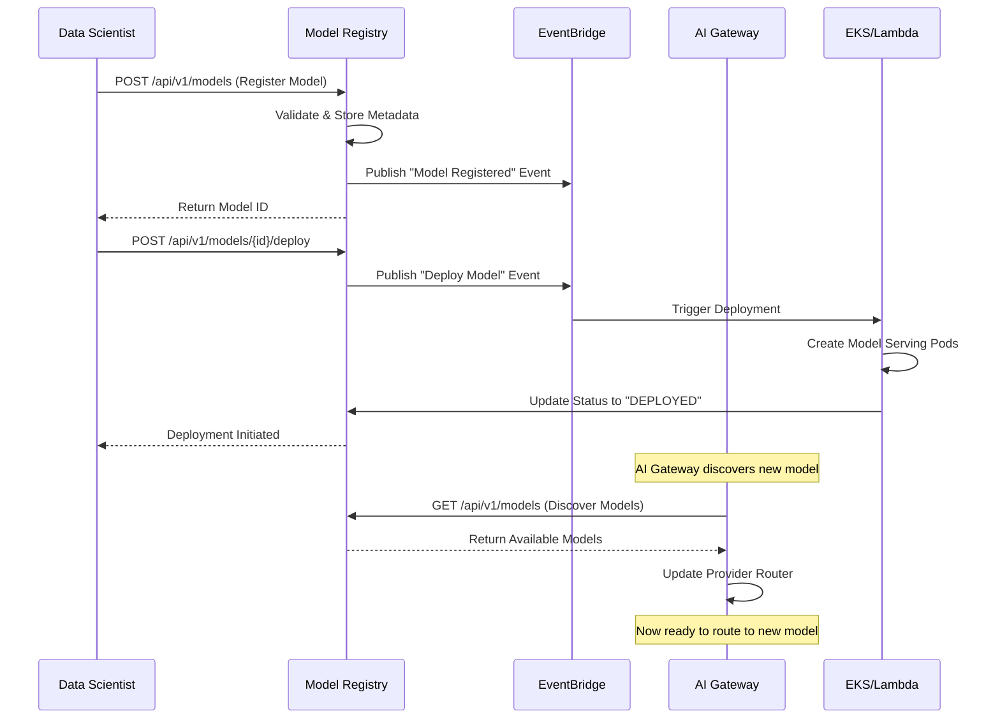
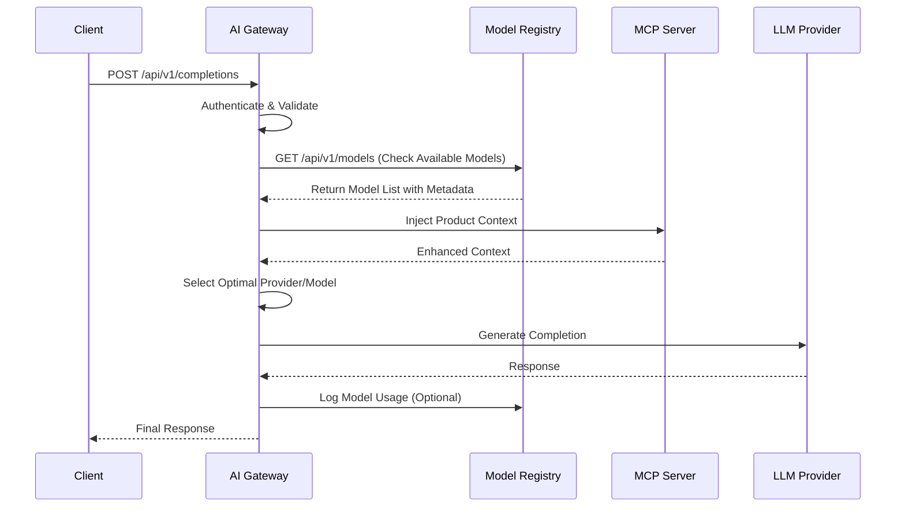
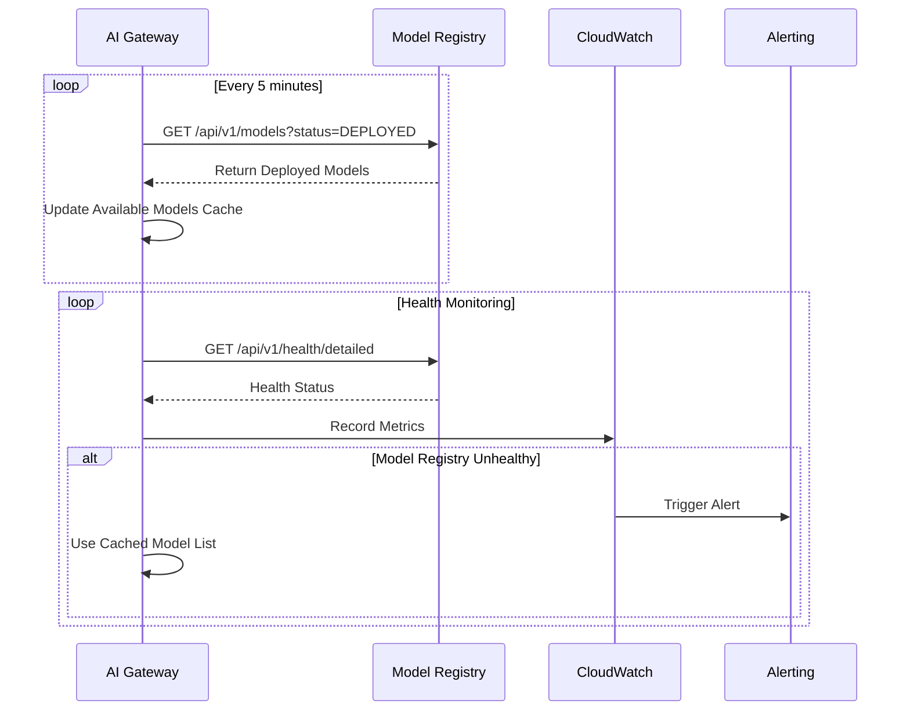

# 🔗 SYSTEM INTEGRATION GUIDE
## How AI Model Gateway & Model Registry Work Together

> **PURPOSE**: Understand how both systems interact to provide a complete ML platform

---

## 🎯 **COMPLETE SYSTEM ARCHITECTURE**

```
┌─────────────────────────────────────────────────────────────────┐
│                    COMPLETE ML PLATFORM                         │
├─────────────────────────────────────────────────────────────────┤
│                                                                 │
│  ┌──────────────────┐              ┌──────────────────┐        │
│  │  AI MODEL        │              │  MODEL           │        │
│  │  GATEWAY         │◄────────────►│  REGISTRY        │        │
│  │                  │              │                  │        │
│  │ • LLM Routing    │              │ • Model Metadata │        │
│  │ • MCP Server     │              │ • Versioning     │        │
│  │ • Auth & Rate    │              │ • Deployment     │        │
│  │   Limiting       │              │   Triggers       │        │
│  │ • Caching        │              │ • Team Access    │        │
│  └──────────────────┘              └──────────────────┘        │
│           │                                 │                   │
│           │                                 │                   │
│  ┌────────▼─────────────────────────────────▼────────────┐     │
│  │              SHARED INFRASTRUCTURE                     │     │
│  │  • DynamoDB (Metadata Storage)                        │     │
│  │  • ElastiCache Redis (Caching Layer)                  │     │
│  │  • S3 (Model Artifacts & Data)                        │     │
│  │  • EventBridge (Event-Driven Communication)           │     │
│  │  • CloudWatch (Unified Monitoring)                    │     │
│  └────────────────────────────────────────────────────────┘     │
│                                                                 │
└─────────────────────────────────────────────────────────────────┘
```

---

## 🔄 **INTEGRATION POINTS: How They Work Together**

### **Integration Point 1: Model Deployment Workflow**



### **Integration Point 2: LLM Request with Model Context**



### **Integration Point 3: Model Discovery & Health Monitoring**



---

## 🧪 **TESTING THE INTEGRATION: Step-by-Step**

### **Setup Instructions:**

#### **Step 1: Deploy Both Systems**
```bash
# Deploy Model Registry
cd model-registry
npm run build
npx cdk deploy model-registry-dev

# Note the API Gateway URL
export MODEL_REGISTRY_URL="<your-model-registry-api-url>"

# Deploy AI Model Gateway
cd ../ai-model-gateway
npm run build
npx cdk deploy ai-gateway-dev

# Note the API Gateway URL
export AI_GATEWAY_URL="<your-ai-gateway-api-url>"
```

#### **Step 2: Configure Postman**
1. Import `Model-Registry.postman_collection.json`
2. Import `Model-Registry.postman_environment.json`
3. Update environment variables:
   - `BASE_URL`: Your Model Registry API Gateway URL
   - `API_KEY`: Your API key (create one if needed)

#### **Step 3: Create Test API Key**
```bash
# Create API key in DynamoDB for testing
aws dynamodb put-item \
  --table-name ai-gateway-dev-api-keys \
  --item '{
    "apiKeyId": {"S": "test-key-123"},
    "apiKeyHash": {"S": "sk-test123456789abcdef"},
    "userId": {"S": "test-user"},
    "tier": {"S": "enterprise"},
    "groups": {"L": [{"S": "data-science-team"}, {"S": "ml-engineers"}]},
    "createdAt": {"S": "'$(date -u +%Y-%m-%dT%H:%M:%SZ)'"},
    "isActive": {"BOOL": true}
  }'
```

---

## 🔗 **INTEGRATION TEST SCENARIOS**

### **Scenario 1: Complete Model Lifecycle** ⭐ **START HERE**

This demonstrates the full integration between both systems.

#### **Test Flow:**
```
1. Register Model → 2. Deploy Model → 3. Use Model in AI Gateway → 4. Monitor Usage
```

#### **Step-by-Step Postman Requests:**

**1️⃣ Register a Model (Model Registry)**
```
Collection: Model Registry API
Folder: Model Registration
Request: Register TensorFlow Model

Expected Response:
{
  "modelId": "fraud-detection-model",
  "message": "Model registered successfully",
  "registrationTime": "2024-01-15T10:30:00Z"
}

✅ This creates model metadata in DynamoDB
✅ Publishes "Model Registered" event to EventBridge
```

**2️⃣ Verify Model Registration (Model Registry)**
```
Collection: Model Registry API
Folder: Model Discovery
Request: Get All Versions of a Model

Use the MODEL_ID from step 1

Expected Response:
[
  {
    "modelId": "fraud-detection-model",
    "version": "1.0.0",
    "framework": "tensorflow",
    "deploymentTarget": "Lambda",
    "status": "REGISTERED",
    "teamId": "data-science-team",
    ...
  }
]

✅ Confirms model is in registry
✅ Shows current status
```

**3️⃣ Deploy the Model (Model Registry)**
```
Collection: Model Registry API
Folder: Model Deployment
Request: Trigger Model Deployment

Expected Response:
{
  "deploymentId": "deploy-abc123",
  "message": "Deployment initiated",
  "status": "DEPLOYING",
  "modelId": "fraud-detection-model",
  "version": "1.0.0"
}

✅ Triggers deployment pipeline
✅ Updates model status to DEPLOYING
✅ Publishes deployment event
```

**4️⃣ Check Deployment Status (Model Registry)**
```
Collection: Model Registry API
Folder: Model Discovery
Request: Get Specific Model Version

Wait 2-3 minutes, then check status

Expected Response:
{
  "modelId": "fraud-detection-model",
  "version": "1.0.0",
  "status": "DEPLOYED",  // Changed from DEPLOYING
  "deploymentInfo": {
    "endpoint": "https://...",
    "deployedAt": "2024-01-15T10:35:00Z"
  }
}

✅ Model is now deployed and ready
```

**5️⃣ Use Model via AI Gateway (AI Model Gateway)**
```
Collection: AI Model Gateway
Folder: LLM Completions
Request: LLM Completion with MCP Context

Body:
{
  "model": "gpt-4",
  "messages": [
    {
      "role": "user",
      "content": "Analyze this transaction for fraud: amount=$5000, location=Nigeria, new_account=true"
    }
  ],
  "metadata": {
    "useRegisteredModels": true,
    "modelRegistry": "fraud-detection-model"
  }
}

Expected Response:
{
  "choices": [...],
  "usage": {...},
  "metadata": {
    "registeredModelUsed": "fraud-detection-model",
    "modelVersion": "1.0.0",
    "provider": "openai"
  }
}

✅ AI Gateway discovered the registered model
✅ Used model metadata for enhanced processing
✅ Logged usage back to Model Registry
```

**6️⃣ Check Model Usage Statistics (Model Registry)**
```
Collection: Model Registry API
Folder: Analytics & Statistics
Request: Get Model Statistics

Expected Response:
{
  "totalModels": 3,
  "totalVersions": 5,
  "modelsByFramework": {
    "tensorflow": 2,
    "pytorch": 1
  },
  "modelsByDeploymentTarget": {
    "Lambda": 2,
    "EKS": 1
  },
  "modelsByStatus": {
    "DEPLOYED": 3,
    "REGISTERED": 2
  }
}

✅ Shows platform-wide statistics
✅ Demonstrates both systems working together
```

---

### **Scenario 2: Model Discovery by AI Gateway** 

This shows how AI Gateway discovers available models.

#### **Test Flow:**
```
1. Register Multiple Models → 2. AI Gateway Queries Registry → 3. Routes Requests
```

#### **Postman Requests:**

**1️⃣ Register Multiple Models (Model Registry)**
```
Run these requests in sequence:
- Register TensorFlow Model
- Register PyTorch Model for EKS
- Register Scikit-Learn Model

✅ Creates diverse model portfolio
```

**2️⃣ List All Available Models (Model Registry)**
```
Request: List All Models

Expected Response:
{
  "models": [
    {
      "modelId": "fraud-detection-model",
      "framework": "tensorflow",
      "deploymentTarget": "Lambda",
      "status": "DEPLOYED"
    },
    {
      "modelId": "recommendation-engine",
      "framework": "pytorch",
      "deploymentTarget": "EKS",
      "status": "DEPLOYED"
    },
    {
      "modelId": "customer-churn-predictor",
      "framework": "scikit-learn",
      "deploymentTarget": "Lambda",
      "status": "REGISTERED"
    }
  ],
  "pagination": {...}
}

✅ AI Gateway can discover all models
✅ Knows deployment targets and status
```

**3️⃣ Filter Models by Deployment Target (Model Registry)**
```
Request: List Models by Deployment Target
Query: ?deploymentTarget=EKS

Expected Response:
{
  "models": [
    {
      "modelId": "recommendation-engine",
      "framework": "pytorch",
      "deploymentTarget": "EKS",
      "status": "DEPLOYED"
    }
  ]
}

✅ AI Gateway can filter by deployment type
✅ Routes EKS requests appropriately
```

**4️⃣ Use Specific Model (AI Gateway)**
```
Request: LLM Completion with Model Preference

Body:
{
  "model": "gpt-4",
  "messages": [...],
  "metadata": {
    "preferredModel": "recommendation-engine",
    "deploymentTarget": "EKS"
  }
}

✅ AI Gateway routes to EKS-deployed model
✅ Uses Model Registry metadata for routing
```

---

### **Scenario 3: Team-Based Access Control**

This demonstrates group-based access across both systems.

#### **Test Flow:**
```
1. Register Models with Team Context → 2. Query by Team → 3. Enforce Access
```

#### **Postman Requests:**

**1️⃣ Register Model for Specific Team (Model Registry)**
```
Request: Register TensorFlow Model

Body includes:
{
  "teamId": "data-science-team",
  ...
}

✅ Model is associated with team
```

**2️⃣ List Models by Team (Model Registry)**
```
Request: List Models by Team
Query: ?teamId=data-science-team

Expected Response:
{
  "models": [
    // Only models belonging to data-science-team
  ]
}

✅ Team-based filtering works
```

**3️⃣ Access Model via AI Gateway with Team Context (AI Gateway)**
```
Request: LLM Completion
Headers: X-API-Key: <team-specific-key>

✅ AI Gateway validates team access
✅ Only shows models team can access
✅ Enforces group-based permissions
```

---

### **Scenario 4: Error Handling & Resilience**

This tests how systems handle failures gracefully.

#### **Test Flow:**
```
1. Trigger Errors → 2. Verify Graceful Degradation → 3. Recovery
```

#### **Postman Requests:**

**1️⃣ Register Invalid Model (Model Registry)**
```
Request: Invalid S3 URI (Should Fail)

Expected Response: 400 Bad Request
{
  "error": {
    "type": "VALIDATION_ERROR",
    "message": "Invalid S3 URI format"
  }
}

✅ Proper validation and error messages
```

**2️⃣ Register Duplicate Model (Model Registry)**
```
Request: Register Duplicate Model (Should Fail)

Expected Response: 409 Conflict
{
  "error": {
    "type": "DUPLICATE_RESOURCE",
    "message": "Model version already exists"
  }
}

✅ Prevents duplicate registrations
```

**3️⃣ Access Non-Existent Model (Model Registry)**
```
Request: Get Non-Existent Model (Should Fail)

Expected Response: 404 Not Found

✅ Proper error handling
```

**4️⃣ AI Gateway with Registry Down (AI Gateway)**
```
Scenario: Model Registry is unavailable

AI Gateway Behavior:
- Uses cached model list
- Continues serving requests
- Logs warning about registry unavailability

✅ Graceful degradation
✅ System remains operational
```

---

## 📊 **MONITORING THE INTEGRATION**

### **CloudWatch Metrics to Watch:**

```bash
# Model Registry Metrics
aws cloudwatch get-metric-statistics \
  --namespace ModelRegistry \
  --metric-name ModelRegistrations \
  --start-time $(date -d '1 hour ago' -u +%Y-%m-%dT%H:%M:%S) \
  --end-time $(date -u +%Y-%m-%dT%H:%M:%S) \
  --period 300 \
  --statistics Sum

# AI Gateway Metrics
aws cloudwatch get-metric-statistics \
  --namespace AiModelGateway \
  --metric-name LLMRequests \
  --start-time $(date -d '1 hour ago' -u +%Y-%m-%dT%H:%M:%S) \
  --end-time $(date -u +%Y-%m-%dT%H:%M:%S) \
  --period 300 \
  --statistics Sum

# Integration Health
aws cloudwatch get-metric-statistics \
  --namespace AiModelGateway \
  --metric-name ModelRegistryHealthChecks \
  --start-time $(date -d '1 hour ago' -u +%Y-%m-%dT%H:%M:%S) \
  --end-time $(date -u +%Y-%m-%dT%H:%M:%S) \
  --period 300 \
  --statistics Average
```

### **EventBridge Events to Monitor:**

```bash
# Check EventBridge events
aws events list-rules --name-prefix model-

# View event details
aws cloudwatch-logs filter-log-events \
  --log-group-name /aws/events/model-registry \
  --start-time $(date -d '1 hour ago' +%s)000
```

---

## 🎯 **KEY INTEGRATION APIS**

### **APIs That Trigger Cross-System Interaction:**

#### **1. Model Registration → Deployment Pipeline**
```
POST /api/v1/models
↓
EventBridge: "Model Registered"
↓
Deployment Service (EKS/Lambda)
↓
AI Gateway discovers new model
```

#### **2. Model Deployment → Gateway Discovery**
```
POST /api/v1/models/{id}/deploy
↓
EventBridge: "Model Deployed"
↓
AI Gateway: GET /api/v1/models
↓
Provider Router updated
```

#### **3. LLM Request → Model Usage Logging**
```
POST /api/v1/completions (AI Gateway)
↓
Check Model Registry for available models
↓
Use model metadata for routing
↓
Log usage back to Model Registry
```

#### **4. Health Monitoring → System Status**
```
GET /api/v1/health/detailed (Both systems)
↓
Cross-check dependencies
↓
Report integrated health status
```

---

## 🚀 **QUICK START TESTING GUIDE**

### **5-Minute Integration Test:**

1. **Import Postman Collections** (both AI Gateway and Model Registry)
2. **Run "Register TensorFlow Model"** (Model Registry)
3. **Run "Get All Versions of a Model"** (Model Registry) - Verify registration
4. **Run "Trigger Model Deployment"** (Model Registry)
5. **Run "LLM Completion with MCP Context"** (AI Gateway) - Uses registered model
6. **Run "Get Model Statistics"** (Model Registry) - See usage stats

**✅ If all 6 requests succeed, your integration is working perfectly!**

---

## 🎯 **INTERVIEW TALKING POINTS**

### **When Asked About System Integration:**
```
"The AI Model Gateway and Model Registry work together through event-driven 
architecture. When a model is registered in the registry, it publishes events 
that trigger deployment pipelines. The AI Gateway periodically discovers 
available models and uses their metadata for intelligent routing decisions. 
This loose coupling ensures both systems can operate independently while 
providing a cohesive ML platform experience."
```

### **When Asked About Failure Handling:**
```
"If the Model Registry is unavailable, the AI Gateway uses cached model 
information to continue serving requests. This graceful degradation ensures 
the platform remains operational even during partial outages. We monitor 
integration health through CloudWatch metrics and EventBridge event tracking."
```

---

**🎉 You now have complete visibility into how both systems work together to provide a production-grade ML platform!**